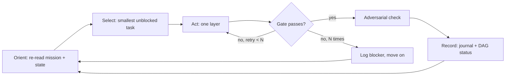
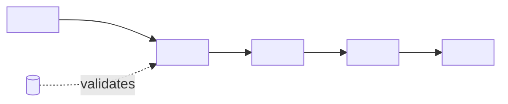

# Autonomous loop MISSION - <project name>

> This file is the "goal file". The agent RE-READS it at the start of every iteration.
> Goal: the agent drives the project forward on its own, verifies its own work with machine gates,
> and stops only where a human is genuinely required. Launch instructions are at the bottom.
> Fill every <…> placeholder before launching. Delete bracketed guidance notes.
>
> Keep this file LEGIBLE, not a wall of prose. The three diagrams in §0.1 carry the essence; the
> text explains only what a diagram cannot. If a section grows past a screen, it probably belongs in
> a diagram or a linked doc.

---

## 0. MISSION (one sentence)

<One-sentence end goal. E.g. "Advance <project> by completing as many open <tasks doc> items as
possible, where every step is machine-verified, without violating the rules below.">

**In scope:** <the blockable core>. **Out of scope / later:** <deferred slice - must never block the core>.

## 0.1 BIG PICTURE (diagrams - the essence, re-read these first)

> These three diagrams are the map. They exist so the essence never drowns in text as the plan
> grows. Update the task-DAG node classes every iteration - the graph IS live state, not decoration.

**A. The loop (how each iteration flows).**



**B. Task dependency DAG (the critical path - node color = live status).**

> Draw one node per work-queue task; edges = "must exist before". Recolor nodes each iteration.
> The critical path is the longest done→todo chain: work the keystone that unblocks the most, not
> merely the smallest task. If a task everyone waits on is `todo`, it wins over an easy leaf.

```mermaid
graph TD
  <T1>[<T1 short label>]:::done --> <T2>[<T2 short label>]:::partial
  <T2> --> <T3>[<T3 short label>]:::todo
  <T2> --> <T4>[<T4 short label>]:::blocked
  <T5>[<T5 human-gated>]:::human -.-> <T3>

  classDef done    fill:#1f7a1f,color:#fff,stroke:#0d3d0d;
  classDef partial fill:#b8860b,color:#fff,stroke:#5c4405;
  classDef todo    fill:#444,color:#fff,stroke:#111;
  classDef blocked fill:#a11111,color:#fff,stroke:#500;
  classDef human   fill:#6a1b9a,color:#fff,stroke:#3a0d52,stroke-dasharray:5 3;
```

Legend: green = done+gated · amber = partial · grey = not started · red = blocked · purple dashed = human-gated.
**Keystone this cycle:** <the node that unblocks the most downstream work>.

**C. Data flow (inputs → producers → product → consumers).**

> Trace where truth is produced and where it is read, so a change's blast radius is obvious. Mark
> the step that must run to regenerate product state, and any step that is expensive (see §8).



## 1. NON-NEGOTIABLE RULES (read BEFORE every action)

[Copy the project's golden rules from CLAUDE.md verbatim, then keep the defaults below.]

1. <Project golden rule 1 - e.g. "Reference data is for validation only, never an input; never fit
   parameters to make output match the reference.">
2. <Project golden rule 2…>
3. **DO NOT `git commit` / `git push`.** Leave changes in the working tree and summarize what
   changed for human review. No automatic commits after each unit.
4. **Smallest / cheapest work first, but keystone over leaf.** Prefer the smallest task that also
   unblocks the most downstream nodes (§0.1 B). Expensive or wide-reaching changes need an explicit
   justification in the journal; if a change might be destructive, STOP and ask.
5. **STOP, DO NOT FABRICATE.** If a task needs an answer that is not in the project's data (an
   external decision, a missing reference, an unclear acceptance criterion), record the question in
   <status/blockers file> and move to the next task. Never guess and proceed.
6. **No silent duplication.** Before adding a producer/path, check §7 hygiene: if one already does
   this job, extend it or mark the old one dead - do not ship a second parallel path unannounced.

## 2. THE LOOP (five steps, repeat)

1. **ORIENT** - re-read this file (esp. §0.1 diagrams) + <status doc> (state) + <CLAUDE.md / rules>.
   From <tasks doc> and the work queue below, pick the NEXT task: smallest that is unblocked in the
   §0.1 B DAG, preferring the keystone.
2. **ACT** - do that one task. Small steps. Call tools, edit files, run commands. One layer at a time.
3. **VERIFY (gates, see §3)** - prove with a machine gate that the task is done. No proof = not done.
4. **ADVERSARIALLY CHECK** - a second, skeptical pass from a different angle than the one that did
   the work. (Does the test actually cover the change, or is it tautological? Is the result sane on
   its own terms, not just "matches the reference"? Did this change leave a now-dead path - §7?)
5. **RECORD** - update <journal/findings file> (what you did, found, what passed) and <status doc>.
   **Recolor the §0.1 B node** for this task (todo→partial→done/blocked). Mark the <tasks doc> item
   done only if its gate passed. Then → 1.

## 3. VERIFICATION GATES (what "done" means - required proof)

[Fill with the project's REAL commands. These are the only valid definitions of done.]

```bash
# Tests
<exact test command, e.g. npm test / pytest -q / go test ./...>

# Build / type-check / lint
<exact build command>
<exact type-check / lint command>

# Project-specific validator (if any)
<exact validator command, with what a passing result looks like>

# Product regen (if producers changed) - mark which steps are EXPENSIVE in §8
<exact regen + sync commands, in dependency order>
```

A task is "done" only when its gate passed AND the evidence is recorded in <journal file>.
A self-declared "done" without a passing gate does NOT count.

## 4. WORK QUEUE (seed - refine from <tasks doc> [ ] each iteration)

[Seed with a few concrete, mostly-deterministic first targets. Each task ID must appear as a node in
the §0.1 B DAG so its dependencies and status are visible. Every task in §7 termination must exist here.]

- [ ] <T1 - small, clear gate, dependencies noted>
- [ ] <T2 - depends on T1>
- [ ] <T3 - depends on T2>

DO NOT work on items marked <human-gated / blocked-on-external> - those are not your gate.

## 5. STATE BETWEEN ITERATIONS (do not rely on chat scrollback)

- The truth about progress lives in FILES: <status doc> (state), <journal/findings file> (log),
  <artifacts, e.g. run outputs>, and the §0.1 B DAG node colors (live task status).
- At the end of each iteration write one line in the journal: `[date] <task> → <gate result>`.

## 6. ERROR HANDLING

- A tool/command failed → diagnose; do NOT leave a half-broken state (half-written file, broken build).
- The same gate fails 3 times without progress → STOP digging, record the blocker in the journal,
  move to the next task, raise the blocker in the final summary.

## 7. HYGIENE & DEAD CODE (detect existing; predict what each change kills)

> A loop that only adds code rots the repo. Treat dead/duplicate code as a first-class gate, not an
> afterthought. Two lists, both kept live:

**A. Already dead / duplicated (detected now - the baseline).**
[Scan at setup and refresh when suspicious: unused exports, orphan files, two producers writing the
same truth, `TODO|deprecated|legacy|fallback|hardcode` markers, a "replaced" path still wired in.]

| item (file:sym) | why suspected dead/dup | replaced by | safe to remove? gate |
|---|---|---|---|
| <path> | <two paths compute same quantity> | <winner path> | <parity test green + no importers> |

**B. Predicted dead AFTER a planned change (blast radius).**
[For each queued task that replaces behavior, name what it makes dead so it is removed WITH the
change, not left to rot. "Migration done" includes retiring the old path.]

- After <task>: <old file/branch> becomes dead → move to `attic/` / delete **only** after <parity gate>.

**Rule:** never delete on suspicion alone. Deletion needs a passing parity gate (new path covers the
old) AND proof of no live importers. If unproven, mark `blocked` and record it - do not guess.

## 8. PERFORMANCE, COST & FLOW BUDGET

> Loops are token-hungry and some steps are slow/destructive. Make the expensive edges explicit so
> the agent prefers the cheap path and does not thrash.

- **Expensive / wide-blast steps** (from §0.1 C): <full regen of all N units, large rebuild, remote calls>.
  Prefer the **surgical** variant (one unit) first; run the full sweep only when required, and diff
  the result to catch silent drift (see drift guard below).
- **Drift guard after any wide regen:** `git status --short <product dirs>` + `git diff --stat`; revert
  any unit you did not intend to touch. <List parked/frozen units that must stay byte-identical.>
- **Parallelism:** independent read-only checks (adversarial verify, per-unit QA) may fan out; writes
  to shared files must not.
- **Loop budget:** if <N> iterations pass with no new gate closed (no-progress budget), STOP and
  hand back to the human - do not spin.

## 9. PLAN SELF-CHECK (verify the PLAN, before and periodically during the loop)

> Run this on the mission itself, not just the code. A plan that lies about its own state sends the
> loop in circles. Fix drift here before selecting the next task.

- [ ] Every §7-termination task ID exists in the §4 queue and as a §0.1 B node.
- [ ] Every §0.1 B node status matches the real <tasks doc> checkbox and code reality (no stale `todo`
      for work already shipped, no `done` without a green gate).
- [ ] The dependency DAG is acyclic and the keystone is named.
- [ ] Every gate command in §3 runs as written (paths/scripts exist).
- [ ] Every file:line reference in the plan still resolves (code moves; references rot).
- [ ] §7 hygiene lists are current - no new duplicate path shipped un-listed.
- [ ] Nothing in §0 out-of-scope has quietly become a blocker of the in-scope core.

## 10. TERMINATION CONDITION (when to end the WHOLE loop)

Stop and write a final summary when ANY holds:
- (a) All deterministic queue items are done and their gates are green; only <human-gated> items remain;
- (b) Every remaining task is blocked on a human-gated question (recorded per §1.5);
- (c) A deliberate safety limit is reached (e.g. an action needing the user's confirmation);
- (d) The no-progress budget (§8) is exhausted.

Final summary: what you finished (with gate evidence), what you recorded as open questions, the §7
dead-code you retired or flagged, what you recommend next, and the EXACT list of changed files (so
the human can review and commit).

---

## How to launch

**Option A - fresh session (recommended, clean context):**
In a new agent session, in the most autonomous permission mode, first message:

> Read `<path to this file>` and execute it as an autonomous loop until the termination condition.
> Start at §2 step 1. Keep the §0.1 diagrams in sync (recolor nodes each iteration). Do not wait for
> my confirmation between iterations, except for §1.4 / §10c cases.

**Option B - `/loop` self-paced (same session, context-resilient):**

> `/loop` Read <path to this file> and continue the autonomous loop: one task per iteration, verify
> with gates, record in the journal, recolor the §0.1 B DAG, stop at the termination condition.
